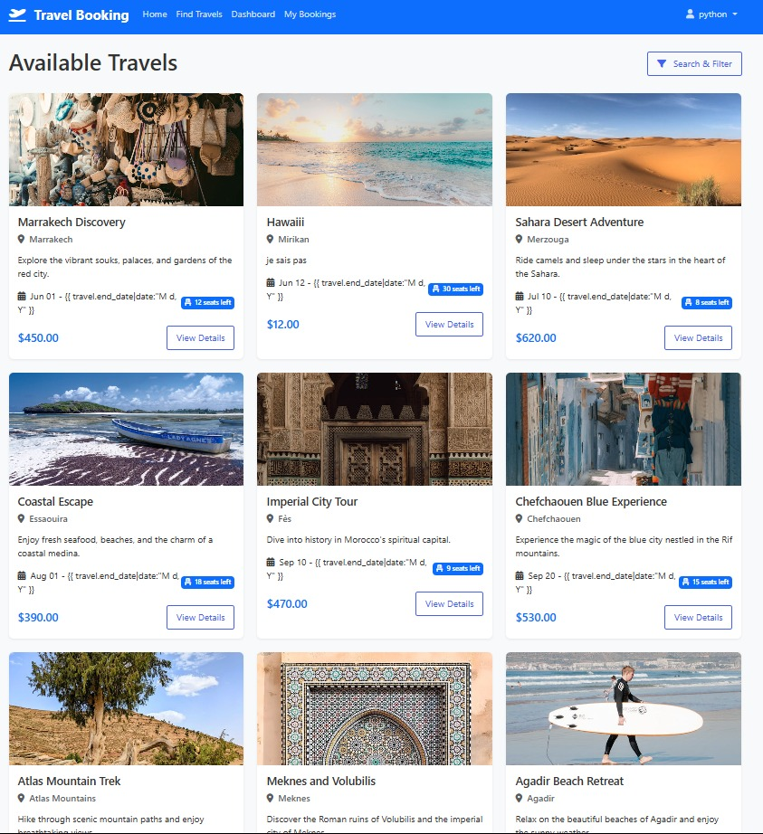
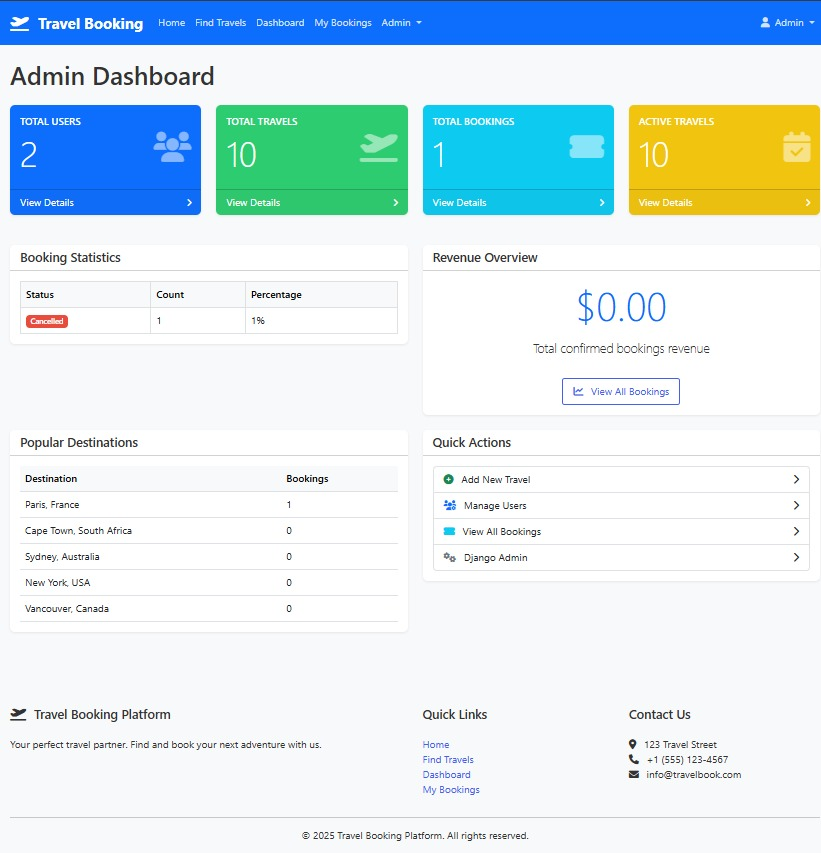
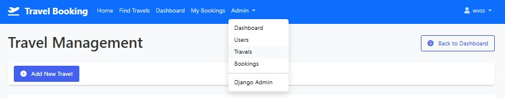
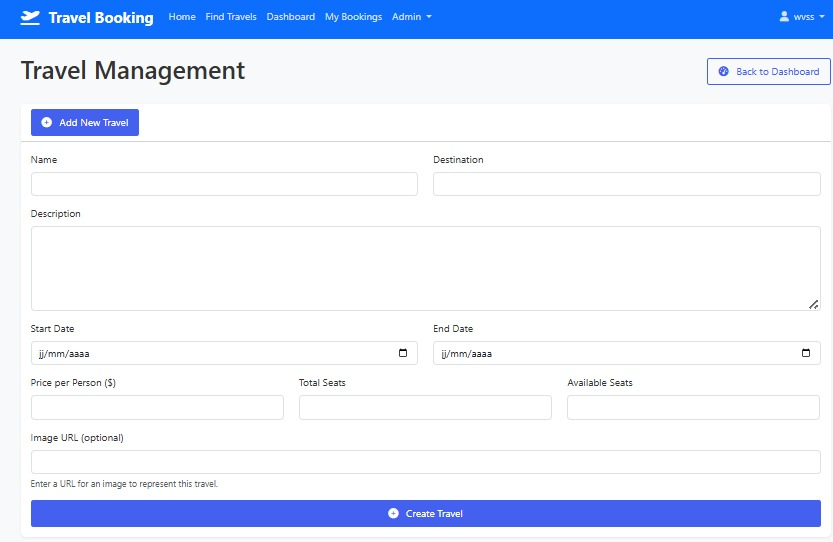
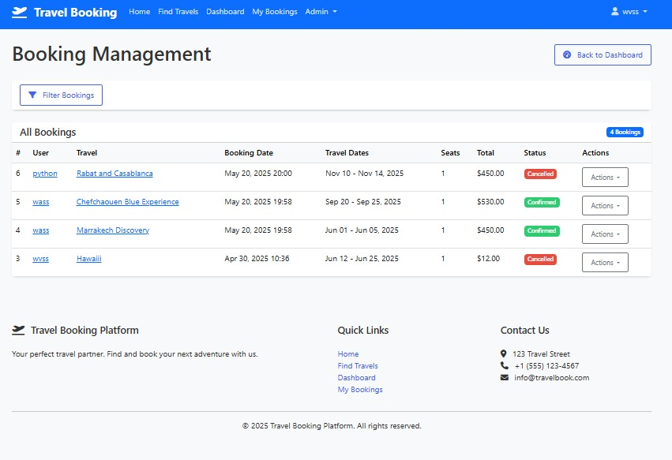

# GESTION-DE-VOYAGE

[](https://github.com/Wvssim/gestion-de-voyage/commits)  
  


---

### 🛠️ Built With

  
  


---

## 📚 Table of Contents

- [Overview](#overview)
- [Screenshots](#screenshots)
- [Getting Started](#getting-started)
  - [Prerequisites](#prerequisites)
  - [Installation](#installation)
  - [Usage](#usage)
  - [Testing](#testing)
- [Contact](#contact)

---

## 📖 Overview

**TRAVELBOOKER** is a powerful travel booking application designed to simplify itinerary management and enhance user experience for both developers and travelers.

### ✨ Features

- 🚀 **Automated Database Setup**: Quickly populate your database with essential data and reduce setup time.
- 🛠️ **Management Commands**: Use Django’s CLI tools to automate admin tasks efficiently.
- 🌐 **User-Friendly Interface**: A clean and intuitive front-end for easier travel planning.
- 📊 **Admin Dashboard**: Gain control with a detailed dashboard showing statistics and booking info.
- 🔐 **Secure Authentication**: Safe and simple user registration and profile management.
- 🧩 **Custom Template Filters**: Enhance templates with custom formatting and rendering logic.

---

## 🖼️ Screenshots

### 🏠 Homepage


### 📋 Trip Management


### 🧑‍💼 Admin Dashboard


### 🔍 Navigation Bar



### ➕ Add New Trip


### 📆 Booking Page



---

## 🚀 Getting Started

### 🧰 Prerequisites

Make sure you have the following installed:

- **Python 3.x**
- **pip** or **uv** package manager

---

### ⚙️ Installation

1. **Clone the repository**

```bash
git clone https://github.com/Wvssim/gestion-de-voyage.git
